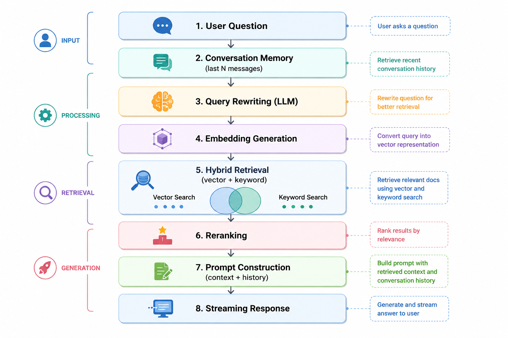

# RAG Service

Reference implementation of a Retrieval-Augmented Generation (RAG) pipeline supporting ingestion, hybrid retrieval, 
reranking, and streaming responses.

---

## Architecture Overview

### LLM Runtime
- **Ollama** (local model serving)

### Models

#### Chat Models
- **Fast / Low-latency**
  - `qwen2.5`
  - `qwen2.5:0.5b`

#### Reranker
- `mistral-small`

#### Embeddings
- `nomic-embed-text`

---

## Pipeline Flow

---

## Prerequisites

Ensure the following are installed:

- Docker & Docker Compose
- Ollama
- uv install dependencies

Pull required models:

```bash
ollama pull qwen2.5
ollama pull qwen2.5:0.5b
ollama pull nomic-embed-text
ollama pull mistral-small
```
---

# Running the Service
## Build and start the stack:
```bash
docker compose build --no-cache
docker compose up
```
The APIs will be available at:
- chat
  - http://localhost:8000/ask
- ingestion
  - http://localhost:8000/ask

---
# API Usage
## 1. Ingestion

Ingest sample documents to populate the retrieval index.
```bash
curl -X POST http://localhost:8000/ingest \
  -H "Content-Type: application/json" \
  -d '{
    "text": "A backup failure occurs when data cannot be written to storage or restored properly.",
    "doc_id": "doc1"
  }'
```

```bash
curl -X POST http://localhost:8000/ingest \
  -H "Content-Type: application/json" \
  -d '{
    "text": "A database transaction failure happens when ACID properties are violated during commit.",
    "doc_id": "doc2"
  }'
```
```bash
curl -X POST http://localhost:8000/ingest \
  -H "Content-Type: application/json" \
  -d '{
    "text": "Ollama is a local runtime for running large language models like Qwen and Mistral.",
    "doc_id": "doc3"
  }'
```
# Retrieval / Question Answering
## Test 1 — Semantic Query

```bash
curl -X POST http://localhost:8000/ask \
  -H "Content-Type: application/json" \
  -d '{
    "question": "What happens when a backup fails?"
  }'
```
## Expected behavior:
- Retrieves semantically similar content
- Returns explanation of backup failure


## Test 2 — Keyword-heavy Query

```bash
curl -X POST http://localhost:8000/ask \
  -H "Content-Type: application/json" \
  -d '{
    "question": "ACID transaction commit failure database"
  }'
```

## Expected behavior:
- Keyword matching is effective
- Relevant document about ACID violations is retrieved


## Test 3 — Noisy / Indirect Query

```bash
curl -X POST http://localhost:8000/ask \
  -H "Content-Type: application/json" \
  -d '{
    "question": "Why does my system fail to save data when something breaks?"
  }'
```

## Expected behavior:
- Query rewriting improves retrieval
- Correct document is retrieved despite vague phrasing

---

# Testing
## Evaluation Frameworks
- Ragas — retrieval and answer quality evaluation
- DeepEval — behavioral and LLM evaluation


## todo
- enable ranking
- fix answer accuracy ragas
- fine deepeval test
- enable persistent memory using vector